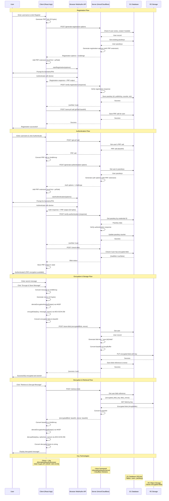

# WebAuthn PRF Demo

```mermaid
sequenceDiagram
    participant User
    participant Client as Client (React App)
    participant Browser as Browser WebAuthn API
    participant Server as Server (Hono/Cloudflare)
    participant DB as D1 Database
    participant R2 as R2 Storage

    Note over User,R2: Registration Flow
    User->>Client: Enter username & click Register
    Client->>Client: Generate PRF Salt (32 bytes)
    Client->>Server: POST /generate-registration-options
    Server->>DB: Check if user exists, create if needed
    DB-->>Server: User record
    Server->>DB: Get existing passkeys
    DB-->>Server: User passkeys
    Server->>Server: Generate registration options (with PRF extension)
    Server-->>Client: Registration options + challenge
    Client->>Client: Add PRF extension (eval.first = prfSalt)
    Client->>Browser: startRegistration(options)
    Browser->>User: Prompt for biometric/PIN
    User-->>Browser: Authenticate with device
    Browser-->>Client: Registration response + PRF output
    Client->>Server: POST /verify-registration (response)
    Server->>Server: Verify registration response
    Server->>DB: Save passkey (id, publicKey, counter, etc)
    DB-->>Server: Success
    Server-->>Client: {verified: true}
    Client->>Server: POST /save-prf-salt (prfSalt base64)
    Server->>DB: Save PRF salt for user
    DB-->>Server: Success
    Server-->>Client: Success
    Client->>User: Registration successful!

    Note over User,R2: Authentication Flow
    User->>Client: Enter username & click Authenticate
    Client->>Server: POST /get-prf-salt
    Server->>DB: Get user's PRF salt
    DB-->>Server: PRF salt (base64)
    Server-->>Client: PRF salt
    Client->>Client: Convert PRF salt to Uint8Array
    Client->>Server: POST /generate-authentication-options
    Server->>DB: Get user & passkeys
    DB-->>Server: User passkeys
    Server->>Server: Generate auth options (with PRF extension)
    Server-->>Client: Auth options + challenge
    Client->>Client: Add PRF extension (eval.first = prfSalt)
    Client->>Browser: startAuthentication(options)
    Browser->>User: Prompt for biometric/PIN
    User-->>Browser: Authenticate with device
    Browser-->>Client: Auth response + PRF output (32 bytes)
    Client->>Server: POST /verify-authentication (response)
    Server->>DB: Get passkey by credential ID
    DB-->>Server: Passkey data
    Server->>Server: Verify authentication response
    Server->>DB: Update passkey counter
    DB-->>Server: Success
    Server-->>Client: {verified: true}
    Client->>Server: POST /check-blob
    Server->>DB: Check if user has encrypted blob
    DB-->>Server: {hasBlob: true/false}
    Server-->>Client: Blob status
    Client->>Client: Store PRF output in state
    Client->>User: Authenticated! (PRF encryption available)

    Note over User,R2: Encryption & Storage Flow
    User->>Client: Enter secret message
    User->>Client: Click "Encrypt & Store Message"
    Client->>Client: Convert message to Uint8Array
    Client->>Client: Generate nonce (12 bytes)
    Client->>Client: deriveEncryptionKey(prfOutput) via HKDF
    Client->>Client: encryptData(key, message, nonce) via AES-GCM-256
    Client->>Client: Convert encrypted data to base64
    Client->>Server: POST /store-blob (encryptedBlob, nonce)
    Server->>DB: Get user
    DB-->>Server: User record
    Server->>Server: Generate blob key: "user-{id}-blob"
    Server->>Server: Convert base64 to ArrayBuffer
    Server->>R2: PUT encrypted blob with key
    R2-->>Server: Success
    Server->>DB: Save blob reference & nonce
    DB-->>Server: Success
    Server-->>Client: {success: true}
    Client->>User: Successfully encrypted and stored!

    Note over User,R2: Decryption & Retrieval Flow
    User->>Client: Click "Retrieve & Decrypt Message"
    Client->>Server: POST /retrieve-blob
    Server->>DB: Get user blob reference
    DB-->>Server: {encrypted_blob_key, blob_nonce}
    Server->>R2: GET blob by key
    R2-->>Server: Encrypted blob (ArrayBuffer)
    Server->>Server: Convert to base64
    Server-->>Client: {encryptedBlob: base64, nonce: base64}
    Client->>Client: Convert base64 to Uint8Array
    Client->>Client: deriveEncryptionKey(prfOutput) via HKDF
    Client->>Client: decryptData(key, ciphertext, nonce) via AES-GCM-256
    Client->>Client: Convert decrypted bytes to string
    Client->>User: Display decrypted message!

    Note over User,R2: Key Technologies
    Note over Client: - React + Vite<br/>- @simplewebauthn/browser<br/>- Web Crypto API (HKDF, AES-GCM)
    Note over Server: - Hono framework<br/>- @simplewebauthn/server<br/>- Cloudflare Workers
    Note over DB: - D1 Database (SQLite)<br/>- Tables: users, passkeys
    Note over R2: - R2 Object Storage<br/>- Stores encrypted blobs
```
